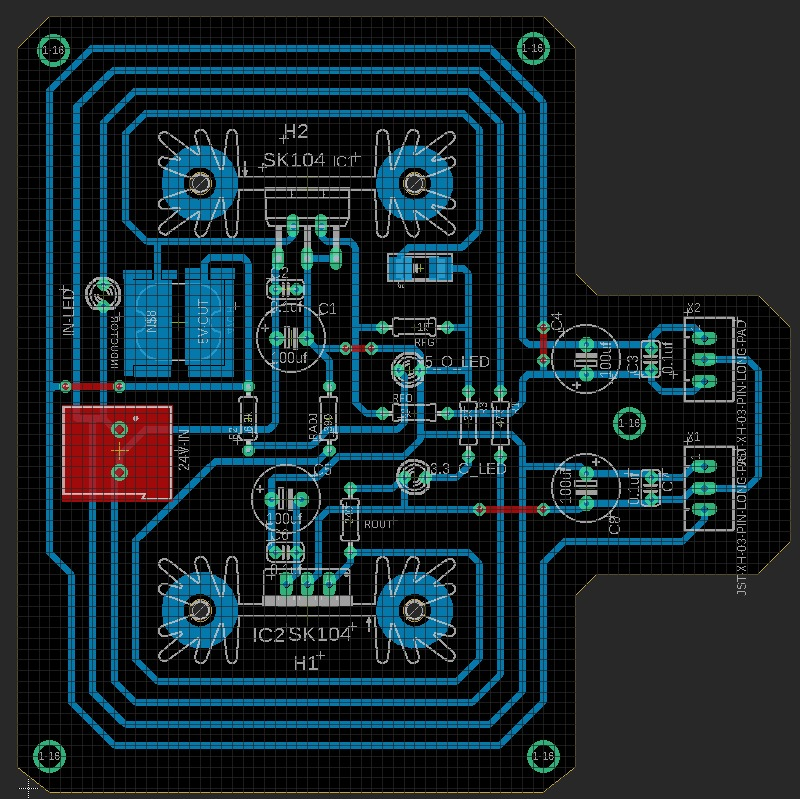

# My Projects
Welcome to my GitHub repository! This repository contains various projects that I have worked on. Below is a list of my projects along with brief descriptions and their Images and Videos.

## Table of Contents
- Project 1: Audio Amplifier
- Project 2: Voltage Regulators
- Project 3: MY RC CAR based on Fixed axis Rotation
- Project 4: Touch sensor using MOSFET
- project 5: CNC PLOTTER
- Project 6: SOS(PCB Board)
  
## Project 1: Audio Amplifier

**Description:**  
whem I learnt about amplifiers in my class I was really eager to make an Audio amplifier so I descided To make audio amplifier.
It is not very much of a big project however i Taught me something crucial that " Dry soldering" can very much the sound.During my intials I was not able to figure out these problems later I understood how different is actual hardware from simulation.

**videos:**  

https://github.com/Mnk-Elec/MY-PROJECTS/assets/172750795/d90b95ba-1b12-46f1-9381-6aa8b9a306f2

https://github.com/Mnk-Elec/MY-PROJECTS/assets/172750795/7a1d6559-57d7-4ba9-be2c-992df1ea41fa

## Project 2: voltage Regulators
I made these volatage regulator during my work in SUDOYANTRA . The Board Takes in 12v unregulated DC supply and uses the Regulator to convert 
12 volt unregulated supply to 5v and 3.3V. This was made so that the microcontroller receives the steady supply of fixed voltage level.

**SCHEMATIC**

**LAYOUT EAGLE**

**ZERO BOARD**

## Project 3: RC CAR

**Description:**
just like every other boys in the contry I to loves the car BUT this I built without the help of Arduino and only Analog modules such as transmitter and receiver module, motor driver and battery.
The mechanism of turning of the car is Quite Interresting During it stops the 2 wheel making a fixed axis and the other 2 wheel moves resulting in turn of car. 

**IMAGE**

**VIDEOS**

https://github.com/Mnk-Elec/MY-PROJECTS/assets/172750795/1d8c223b-1a6f-4da5-9b97-c3bc4befc824

## Project 4: Touch sensor using MOSFET.

**Description:**
This was just a simple experiment I was trying to do with MOSFET as switch and using human body as conductor to connect to earth as Ground.

**IMAGE:**

## Project 5: CNC PLOTTER.

**Description:**
we made this plotter as an activity to understand the 3d desiging ,stepper motor , Motor Driver and software and hardware interaction.

**videos:**

https://github.com/Mnk-Elec/MY-PROJECTS/assets/172750795/89243a60-5b5b-4227-add0-613424ad2c8c

## Project 6: SCIENCE ON STICK.

**Description:**
There is a complete documentation on how this device works. basically It employs read switch to get the intial and final time reading and the emf induced in coil is given to arduino arduino serially prints all the values on the serial monitor . Python program uses time readings and serially plotted emf values to Draw the Graph using MATPLOT LIB.

**PCB BOARD SCHEMATIC**

**PCB BOARD LAYOUT**

**PCB BOARD FABRICATED**

**RESULT**

**VIDEOS**

https://github.com/Mnk-Elec/MY-PROJECTS/assets/172750795/c78f409c-d30b-4e48-8c09-5fce0670ab64

